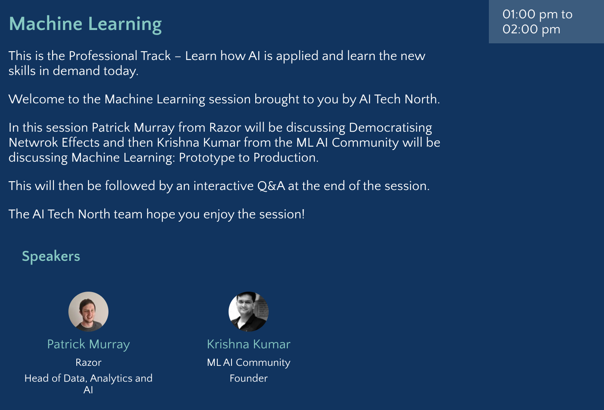

# AI Tech North Summit UK 2020 

This repository contains details of my session at AI North Summit UK 2020

## Machine Learning : Prototype to {Production}

## [Event Link](https://www.aitechnorth.uk/ai-tech-north-2020)

## [Slides](https://docs.google.com/presentation/d/1cJA6_RV_NnrsSqEQLZOSWyK4C1YFekfybU5l48W2kgg/edit?usp=sharing)

## Scan Me 

 
 
## Listing Page 

