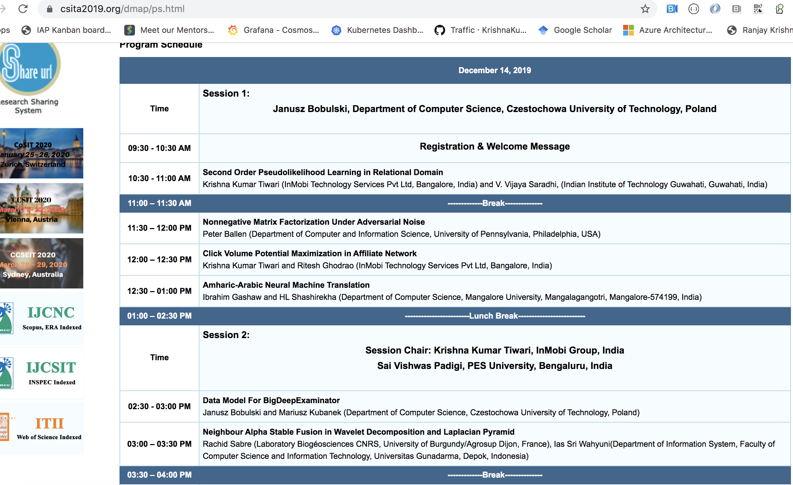

# 5th International Conference on Data Mining and Applications (DMAP 2019)
### December 14~15, 2019, Chennai, India

## Topic : Click Volume Potential Maximization in Affiliate Network

## [Conference Link](https://csita2019.org/dmap/papers.html)

