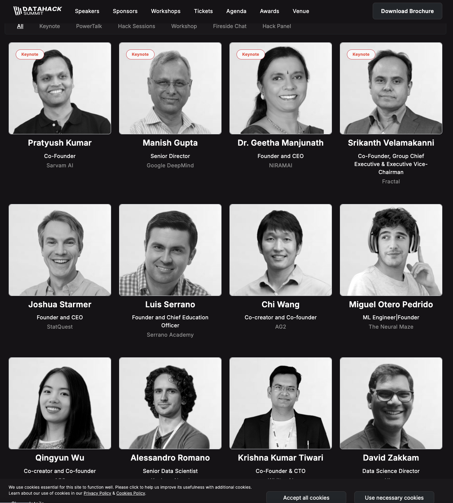
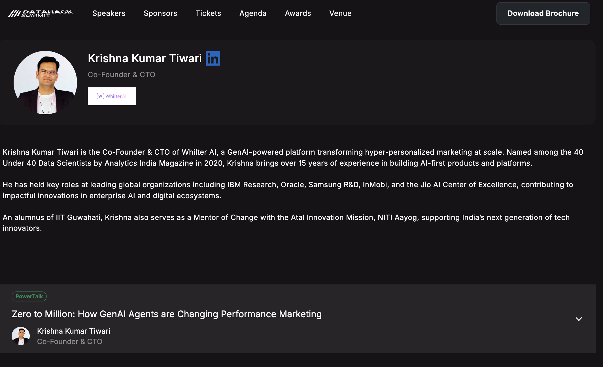

# Talks

## Keeping my talks/presentations here

## 2025
- [DataHack Summit 2025 Bangalore]([https://www.aitechnorth.uk/ai-tech-north-2020](https://www.analyticsvidhya.com/datahacksummit-2025/speakers/krishna-kumar-tiwari))
- [Slides](https://github.com/KrishnaKumarTiwari/talks/blob/master/Krishna-Talk-DataHackSummit-final.pdf)

- [Coverage on Linkedin](https://www.linkedin.com/posts/analytics-vidhya_analyticsvidhya-datahacksummit2025-dhs2025-activity-7364242262274269184-y-Ej?utm_source=share&utm_medium=member_desktop&rcm=ACoAAAREF4sBo3q0_4hIAhcOrY6p8-g04XgIopI)

## 2020

- [AI North Summit 2020 UK](https://www.aitechnorth.uk/ai-tech-north-2020)
- [Recording : 34 M](https://www.youtube.com/watch?v=Lur0Voo6eWw)
- Hack 36 MNNIT Allahabad 15th Feb 2020 
- Happy Sharing Session with Adam 15th Feb 2020
- [Advisory Board Member at AI Forum](https://ai-forum.com/advisory-board/)
- [40 Under 40 Data Scientist Award, India 2020](https://www.youtube.com/watch?v=Q8laoM3UBW4)

## 2019
- NextGen Leadership Summit Dec 6th 2019
- DMAP 2019 : 5th International Conference on Data Mining and Applications
  - Second Order Schedule Likelihood
  - Click Volume Potential Maximization
  

## 2015-18
- Mentoring session on Machine Learning for ML AI Community members

## 2012-15
- Data Strcure & Algorithms mentoring to diffirent colleges 

## 2011
- Prepared for KDD as my paper got accepected in KDD workshop. Was not able to attend because of found issues.

## 2010
- IBM Research Lab, Bangalore, Presented Minute Sense Project to researchers

