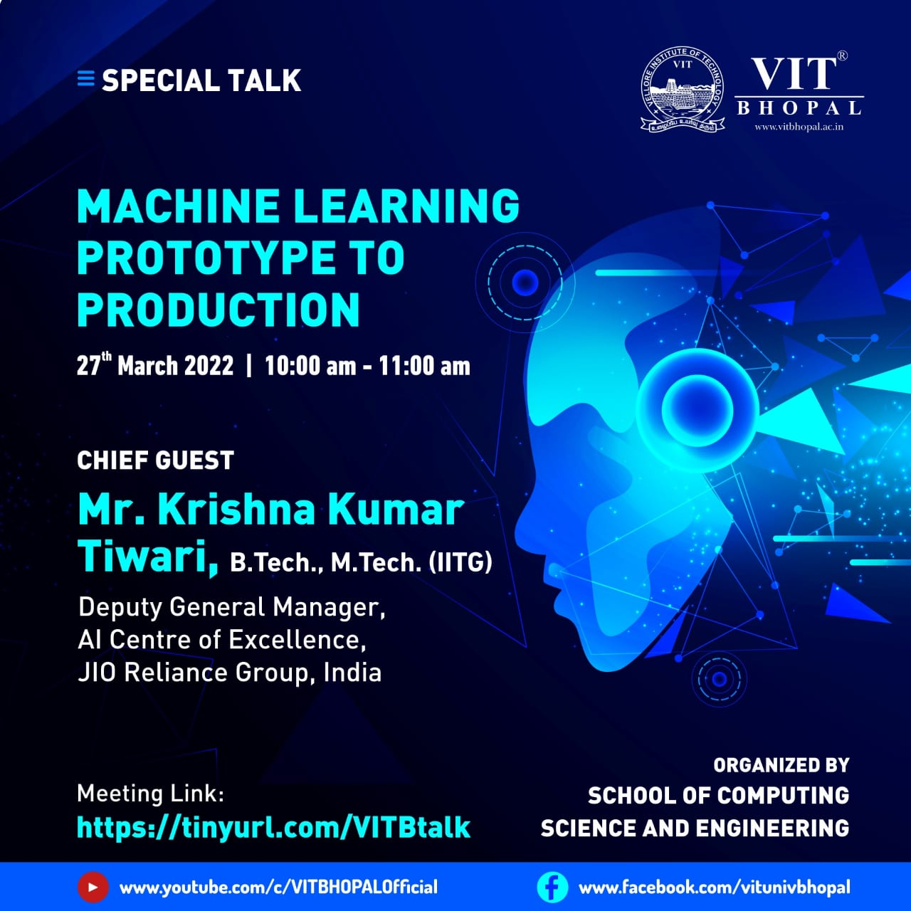

# Talk at VIT Bhopal, 27 March 2022

This repository contains details of my session at Talk at VIT Bhopal 2022 

## Machine Learning : Prototype to {Production}

## [Slides](https://docs.google.com/presentation/d/1xcUJ0rBLJWPwl1RGL5OIJkI75NgUlpiIQswvi7lU-ZY/edit?usp=sharing)

## Event Details 

 
 
## Listing Page 

